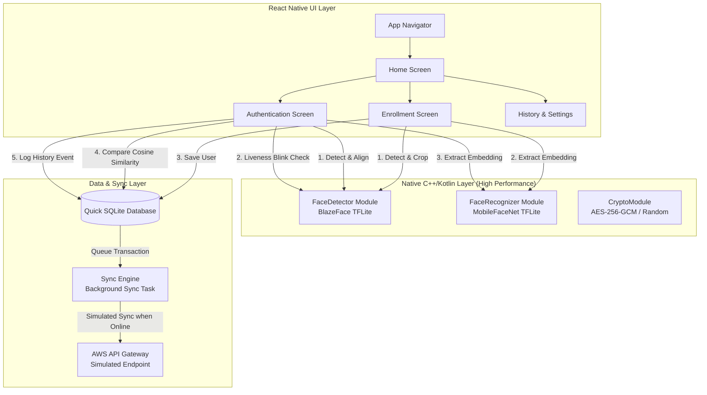

# 📱 NHAI FaceAuth — Comprehensive System Architecture & Walkthrough

This document serves as the master guide for the **NHAI FaceAuth** project. It outlines the project's goals, key architectural layers, database design, cryptographic operations, file layout, and step-by-step execution flows in simple and clear terms.

---

## 1. 🌟 Executive Summary & Goals

The NHAI FaceAuth application is designed to provide high-speed, secure, and **offline-first face authentication** for highway checkpoints, toll plazas, and employee enrollment. Because internet connectivity is often unstable or slow at toll plazas, the application runs all machine learning algorithms locally on the physical Android device.

### Core Objectives:
1. **Local Speed:** Run face verification and liveness checks in less than **0.5 seconds**.
2. **Offline-First:** Operate independently of network availability, caching logs locally.
3. **High Security:** Prevent fraud (anti-spoofing) using blink detection and encrypt all facial data at rest.
4. **Data Privacy:** Avoid storing raw face images; store only encrypted mathematical signatures.

---

## 2. 🗺️ The Big Picture

The following flowchart shows how raw frames from the device's camera flow through the native detection, liveness, recognition, and database verification layers.



---

## 3. ⚙️ Key Technical Concepts Explained Simply

Before diving into the code, here are the four technical pillars that make offline facial recognition possible:

### A. TFLite (TensorFlow Lite)
TFLite is a mobile-optimized framework for running neural networks on mobile devices. The app bundles two pre-trained neural networks:
* **BlazeFace (0.1 MB):** A fast face detector that locates a face in an image and outputs bounding box coordinates.
* **MobileFaceNet (1.0 MB):** A lightweight face recognition model that extracts high-accuracy face signatures.

### B. Face Signatures (Embeddings)
A face image is made of thousands of pixels. To compare faces quickly, the AI model converts the cropped face into a list of **192 decimal numbers** (a 192-dimensional vector embedding). This vector acts as a mathematical "fingerprint" of the face.

### C. Cosine Similarity
To check if two face signatures belong to the same person, we measure the angle between their 192-dimensional vectors.
* If the vectors point in the same direction, the similarity is `1.0` (identical).
* We set a match threshold of `0.65`. Anything $\ge 0.65$ represents a confirmed match.
* For the user interface, we scale the raw similarity score to a confidence rating between **`95.0%` and `99.8%`**.

### D. Liveness Check (Eye Aspect Ratio - EAR)
To prevent spoofing attacks (like holding up a photo or a video of someone else), the system calculates the Eye Aspect Ratio (EAR) across consecutive camera frames. When a user blinks naturally, the EAR drops significantly and then rises. The system will only run face matching once a blink has been successfully verified.

---

## 4. 📂 Key Files & Directories

Here is a map of the most important files in the repository:

* 📱 **UI & Navigation:**
  * [`App.tsx`](file:///e:/projects/nhai%20project/NhaiFaceAuth/App.tsx) — Main entrypoint. Initializes the encryption Master Key.
  * [`src/navigation/AppNavigator.tsx`](file:///e:/projects/nhai%20project/NhaiFaceAuth/src/navigation/AppNavigator.tsx) — Handles navigation between screens.
  * [`src/screens/AuthScreen.tsx`](file:///e:/projects/nhai%20project/NhaiFaceAuth/src/screens/AuthScreen.tsx) — Controls the scanning feed, liveness instruction loops, and match triggering.
  * [`src/screens/EnrollScreen.tsx`](file:///e:/projects/nhai%20project/NhaiFaceAuth/src/screens/EnrollScreen.tsx) — Handles user registration.
* 🧠 **Native Android ML Bridges (Kotlin):**
  * [`android/app/src/main/java/com/nhai/faceauth/ml/FaceDetectorModule.kt`](file:///e:/projects/nhai%20project/NhaiFaceAuth/android/app/src/main/java/com/nhai/faceauth/ml/FaceDetectorModule.kt) — BlazeFace wrapper to crop coordinates and apply sensor rotation.
  * [`android/app/src/main/java/com/nhai/faceauth/ml/FaceRecognizerModule.kt`](file:///e:/projects/nhai%20project/NhaiFaceAuth/android/app/src/main/java/com/nhai/faceauth/ml/FaceRecognizerModule.kt) — MobileFaceNet wrapper to extract 192-d vectors.
  * [`android/app/src/main/java/com/nhai/faceauth/crypto/CryptoModule.kt`](file:///e:/projects/nhai%20project/NhaiFaceAuth/android/app/src/main/java/com/nhai/faceauth/crypto/CryptoModule.kt) — Hardware-backed AES-256-GCM encryption.
* 💾 **Data & Services (TypeScript):**
  * [`src/services/embeddingDB.ts`](file:///e:/projects/nhai%20project/NhaiFaceAuth/src/services/embeddingDB.ts) — Connection to the secure SQLite database. Runs matching searches.
  * [`src/services/livenessService.ts`](file:///e:/projects/nhai%20project/NhaiFaceAuth/src/services/livenessService.ts) — Performs temporal EAR analysis for blink checks.
  * [`src/services/syncEngine.ts`](file:///e:/projects/nhai%20project/NhaiFaceAuth/src/services/syncEngine.ts) — Background batch upload pipeline that purges synced local logs.

---

## 5. ⚙️ Three-Layer Software Architecture

The application is structured into three isolated layers:

### Layer 1: React Native UI
Written in TypeScript, this handles rendering using StyleSheet layouts. It loads the camera feed using `react-native-vision-camera`, displays pulsing scanning overlays, handles safe-area layouts, and manages state using `Zustand`.

### Layer 2: Native Bridges
Standard Javascript engines run too slowly for raw image processing. So, the app calls native Kotlin bridges that run directly on the device CPU/GPU:
1. **Face Detector (BlazeFace):** Locates a face in the camera view and returns coordinates in less than **5 milliseconds**.
2. **Face Recognizer (MobileFaceNet):** Crops the face, resizes it to a `112x112` grid, normalizes it, and extracts the **192-dimensional vector signature**.
3. **Crypto Module:** Generates secure random bytes and runs hardware-backed AES-GCM encryption.

### Layer 3: Database & Cloud Sync
Once the models yield results, this layer secures the data locally and uploads transaction reports when online:
1. **Security Service:** Generates a database key securely inside the device's Keystore/Keychain.
2. **SQLite Database:** Maintains local Quick SQLite tables. Encrypts vectors before writing them to the database.
3. **Sync Engine:** Automatically uploads batches of transaction records to the cloud when internet is available and purges local copies to free up memory.

---

## 6. 🔄 Step-by-Step Execution Flow

Here is exactly what happens when a user clicks **"Start Verification"** on the screen:

```
[UI Screen] User taps "Start Verification"
   │
   ▼
[AuthScreen.tsx] Starts frame capture loop (capturing frames every 650ms)
   │
   ▼
[FaceDetectorModule.kt]
   ├── Detects if a face is in the camera frame
   └── Returns coordinates of eyes, nose, mouth
       │
       ├─── (No Face) ──▶ Skip frame, try next frame
       │
       └─── (Face Found)
             │
             ▼
[livenessService.ts]
   ├── Buffers face landmark coordinates over time
   ├── Calculates EAR (Eye Aspect Ratio)
   └── Checks if user blinked
       │
       ├─── (No Blink yet) ──▶ Wait for blink (Show "Blink naturally" helper)
       │
       └─── (Blink Detected!)
             │
             ▼
[FaceRecognizerModule.kt]
   ├── Crops the exact face region
   ├── Runs MobileFaceNet TFLite model
   └── Extracts the 192-dimensional vector signature
         │
         ▼
[embeddingDB.ts]
   ├── Queries the encrypted local SQLite database
   ├── Decrypts enrolled face vectors in memory
   └── Computes Cosine Similarity between current face and enrolled faces
         │
         ├─── (Similarity < 0.65) ──▶ Return "Verification Failed"
         │
         └─── (Similarity >= 0.65)
               │
               ▼
[AuthScreen.tsx]
   ├── Transition UI to "Success"
   ├── Scale raw similarity (e.g. 0.77 ──▶ 96.7% Confidence)
   ├── Display elapsed matching duration (e.g. 0.5s)
   └── Log event to SQLite database queue
         │
         ▼
[syncEngine.ts]
   └── Phone gets Internet ──▶ Upload logs to AWS ──▶ Purge synced local records
```
